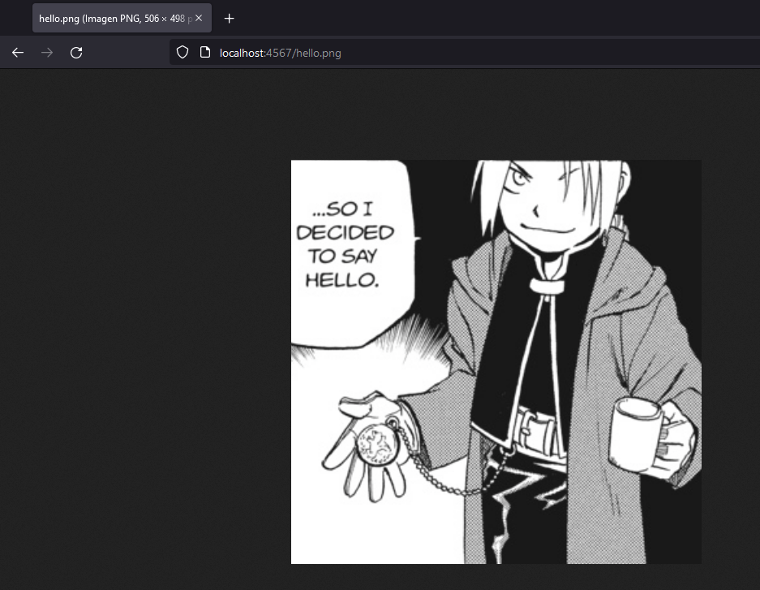

# TALLER DE ARQUITECTURAS DE SERVIDORES DE APLICACIONES, META PROTOCOLOS DE OBJETOS, PATRÓN IOC, REFLEXIÓN

Para este taller se va a construir un servidor Web (tipo Apache) en Java. El servidor es capaz de entregar páginas html e imágenes tipo PNG. Igualmente el servidor debe proveer un framework IoC para la construcción de aplicaciones web a partir de POJOS. Usando el servidor se debe construir una aplicación Web de ejemplo y desplegarlo en Heroku. 
El servidor debe atender múltiples solicitudes no concurrentes.

## Cómo empezar

A continuación podrá encontrar los pasos ccon los cuales puede acceder al sitio web o usar el proyecto de manera local.

### Prerrequisitos

* [Maven](https://maven.apache.org/) - Administrador de dependencias
* [Java ](https://www.oracle.com/co/java/technologies/javase/javase-jdk8-downloads.html)       Ambiente de desarrollo
* [Git](https://git-scm.com/) - Sistema de control de versiones

### Instalación

Para descargar el proyecto ejecute 

    git clone https://github.com/ZulyVargas/AREP_ECISpringBoot.git

Para ejecutar desde la ubicación del proyecto 

    mvn package 

    mvn exec:java -D "exec.mainClass"="edu.escuelaing.arep.run.RunMyServer"
   

En su navegador ingrese a la siguiente dirección para visualizar: 

1. Visualizar una imagen
    
    http://localhost:4567/hello.png

   

2. Visualizar un archivo html

   http://localhost:4567/index.html

   

3. Opciones POJO

   http://localhost:4567/opciones/index
   

   http://localhost:4567/opciones/lottery
   

   http://localhost:4567/opciones/song
   

## Ejecución de  pruebas

    mvn test

## Despliegue

En la página que se le mostrará puede acceder a las diferentes opcines de manera remota sin necesidad de descargar el proyecto.

## Documentación
Para generar la documentación se debe ejecutar:

    mvn javadoc:javadoc

Esta quedará en la carpeta target/site/apidocs.

O diríjase a la siguiente dirección: 

* [Documentación](https://github.com/ZulyVargas/AREP_ECISpringBoot/tree/master/javadoc)

## Construido con 

* [Maven](https://maven.apache.org/) - Administrador de dependencias
* [Heroku](https://heroku.com) - Plataforma de despliegue

## Autores

**Zuly Valentina Vargas Ramírez** 

## Licencia

Este proyecto esta bajo la licencia GNU(General Public License) los detalles se encuentran en el archivo [LICENSE](LICENSE.txt).
